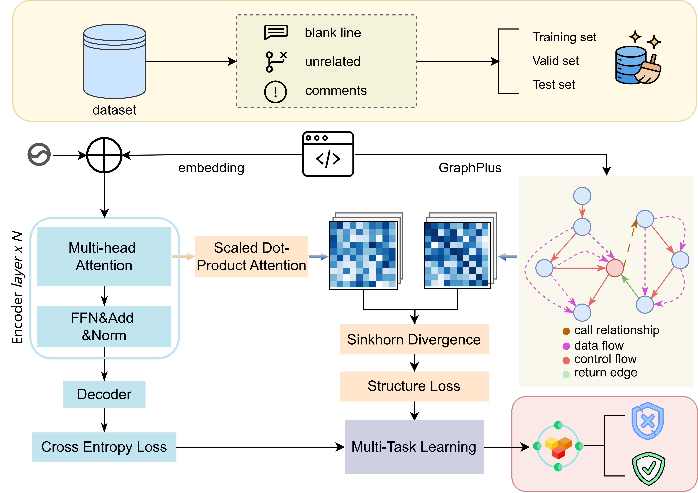

# SIFT: Enhance the performance of vulnerability detection by incorporating structural knowledge and multi-task learning
This is the source code to the paper "SIFT: Enhance the performance of vulnerability detection by incorporating structural knowledge and multi-task learning". Please refer to the paper for the experimental details.

# Approach

## About the Datasets

Due to the large size of the dataset, we provide a download link for the dataset here:

BigVul [1]: [https://drive.google.com/file/d/1-0VhnHBp9IGh90s2wCNjeCMuy70HPl8X/view?usp=sharing](https://drive.google.com/file/d/1-0VhnHBp9IGh90s2wCNjeCMuy70HPl8X/view?usp=sharing)

Reveal [2]: [https://drive.google.com/drive/folders/1KuIYgFcvWUXheDhT--cBALsfy1I4utOyF](https://drive.google.com/drive/folders/1KuIYgFcvWUXheDhT--cBALsfy1I4utOyF)

Devign [3]: https://drive.google.com/file/d/1x6hoF7G-tSYxg8AFybggypLZgMGDNHfF

## Preprocessing

We use Joern to generate the code structure graph and we provide a compiled version of joern [here](https://drive.google.com/drive/folders/1ZktZFTbSR0NoPyFRuJDXmDsJYChoVwhF?usp=share_link). It should be noted that the graphs generated by different versions of Joern may have significant differences. So if using the newer versions of Joern to generate code structure graph, the model may have a different performance compared with the results we reported in the paper.

## Environment

Ubuntu 20.04

## Figure

We put the figures in `figs\` folder

## References

[1] Jiahao Fan, Yi Li, Shaohua Wang, and Tien Nguyen. 2020. A C/C++ Code Vulnerability Dataset with Code Changes and CVE Summaries. In The 2020 International Conference on Mining Software Repositories (MSR). IEEE.

[2] Saikat Chakraborty, Rahul Krishna, Yangruibo Ding, and Baishakhi Ray. 2020. Deep Learning based Vulnerability Detection: Are We There Yet? arXiv preprint arXiv:2009.07235 (2020).

[3] Yaqin Zhou, Shangqing Liu, Jingkai Siow, Xiaoning Du, and Yang Liu. 2019. Devign: Effective vulnerability identification by learning comprehensive program semantics via graph neural networks. In Advances in Neural Information Processing Systems. 10197–10207.

